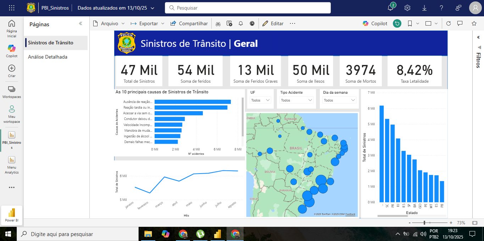
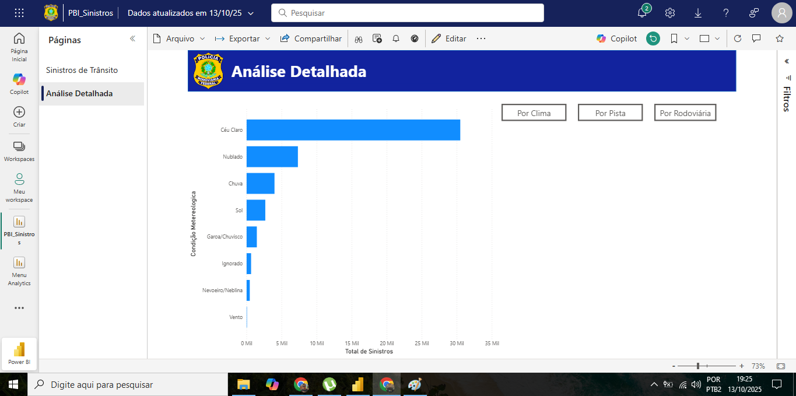

# 📊 Dashboard de Análise de Sinistros - PRF

### [🔗 Clique aqui para acessar o Relatório Interativo Online](https://app.powerbi.com/groups/me/reports/19565ecd-ed3b-42bf-9d2d-8b1a1be9739a/6c3b98b69ac0b39da207?ctid=e8f5849e-5b15-4c2f-b4f3-0386b604971e&experience=power-bi)

---

## 🖼️ Prévia do Dashboard

### Painel Principal

### Análise Detalhada

---

## 🎯 Objetivo do Projeto
Este projeto consiste em um dashboard interativo desenvolvido em Power BI para a análise de dados de sinistros de trânsito registrados pela Polícia Rodoviária Federal. O objetivo principal é fornecer uma ferramenta visual para identificar padrões, principais causas, e as localidades mais críticas, permitindo uma exploração dinâmica e intuitiva dos dados.

---

## 🛠️ Ferramentas Utilizadas
* **Power BI Desktop:** Para criação, modelagem e desenvolvimento do relatório.
* **Power Query:** Para extração, tratamento e limpeza dos dados (ETL).
* **DAX (Data Analysis Expressions):** Para a criação de medidas personalizadas como "Total de Sinistros" e "Taxa de Letalidade".

---

## ✨ Funcionalidades do Relatório
* **KPIs Principais:** Cartões com os indicadores mais importantes (Total de Sinistros, Mortos, Feridos e Taxa de Letalidade).
* **Análise Geográfica:** Mapa interativo que mostra a distribuição de acidentes por estado, com destaque para as áreas mais críticas.
* **Ranking de Causas e Rodovias:** Gráficos que utilizam filtros Top N para exibir as 10 principais causas de acidentes e as 10 rodovias mais perigosas.
* **Navegação entre Páginas:** Botões que permitem uma navegação fluida entre o painel principal e a tela de análise detalhada.
* **Visualização Interativa:** Uso de Favoritos (Bookmarks) e Botões para permitir que o usuário alterne entre diferentes tipos de análise (Por Clima, Por Pista, Por Rodovia) em um mesmo espaço.
* **Filtros Dinâmicos:** Segmentadores de dados que permitem ao usuário filtrar as informações por UF, tipo de acidente e dia da semana.

---

## 📁 Estrutura do Repositório
* **/datatran2025.csv:** O conjunto de dados bruto utilizado no projeto.
* **/Relatorio_PRF.pbix:** O arquivo fonte do Power BI, contendo todas as consultas, medidas e visuais.
* **/dashboard_principal.png** e **/analise_detalhada.png:** Imagens de prévia do relatório final.
